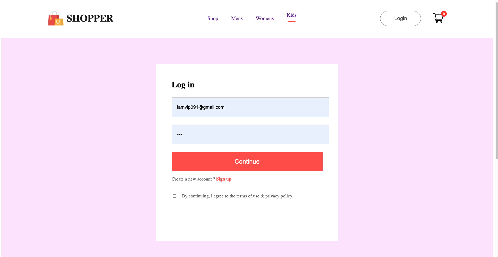

# Shopping Website Project

Welcome to the Shopping Website project! This is a web application developed using the MERN (MongoDB, Express.js, React.js, Node.js) stack. The project is organized into three main folders: `frontend`, `backend`, and `admin`.

## Project Structure

- **frontend:** Contains the React.js application responsible for rendering the user interface and fetching/displaying data from the backend.

- **backend:** Houses the Node.js and Express.js server, which handles database interactions and serves data to the frontend.

- **admin:** Includes the admin panel, allowing administrators to add new products to the database.

# Application Screenshots
## Landing Page

<div style="display: flex; justify-content: space-between;">
  
  
  
  
</div>

## Login/SignUp Page

<div style="display: flex; justify-content: space-between;">
  
  
</div>

## Category Page

<div style="display: flex; justify-content: space-between;">
  
  
  
  
</div>

## Product and Cart Page

<div style="display: flex; justify-content: space-between;">
  
  
  
  
   
</div>

## How to Run the Project

1. **Backend:**
   - Navigate to the `backend` directory using the terminal:
     ```bash
     cd backend
     ```
   - Install the required dependencies:
     ```bash
     npm install
     ```
   - Start the backend server:
     ```bash
     npm start
     ```

2. **Frontend:**
   - Navigate to the `frontend` directory using the terminal:
     ```bash
     cd frontend
     ```
   - Install the required dependencies:
     ```bash
     npm install
     ```
   - Start the frontend application:
     ```bash
     npm start
     ```


3. **Admin:**
   - Navigate to the `admin` directory using the terminal:
     ```bash
     cd admin
     ```
   - Install the required dependencies:
     ```bash
     npm install
     ```
   - Start the admin panel:
     ```bash
     npm run dev
     ```

## Usage

- Access the shopping website by opening your web browser and navigating to [http://localhost:3000](http://localhost:3000).

- The frontend fetches and displays product data from the backend.

- Admins can add new products to the database by accessing the admin panel at [http://localhost:5173](http://localhost:5173).

## Technologies Used

- **MongoDB:** Database for storing product data.
- **Express.js:** Web application framework for the backend server.
- **React.js:** Frontend library for building user interfaces.
- **Node.js:** JavaScript runtime for server-side development.

## Additional Notes

- Make sure MongoDB is installed and running.
- Customize the configuration files if necessary.
- This project was developed as a demonstration of MERN stack capabilities. Feel free to explore, modify, and extend it as needed for your own projects.
